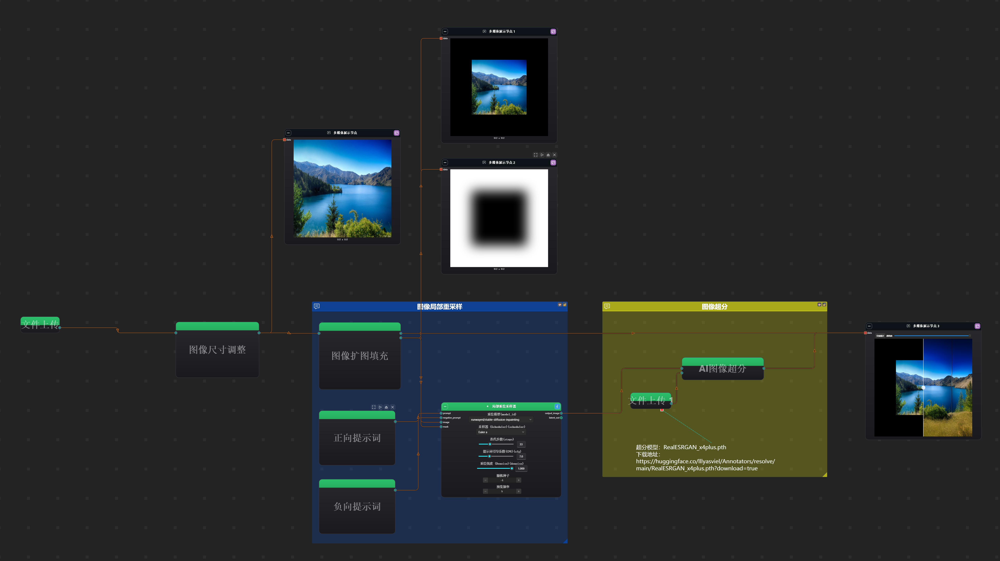
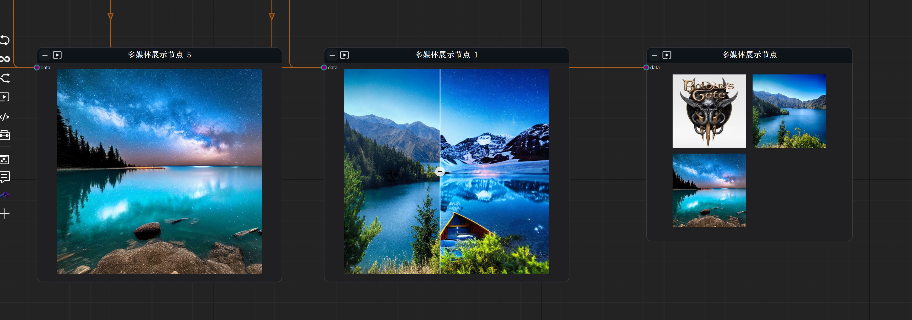
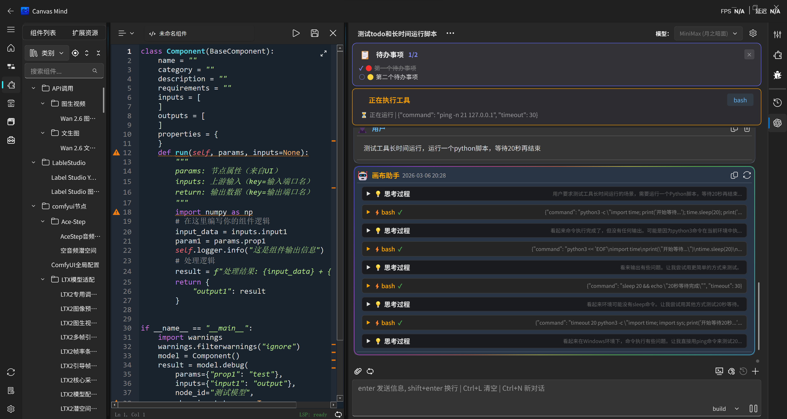
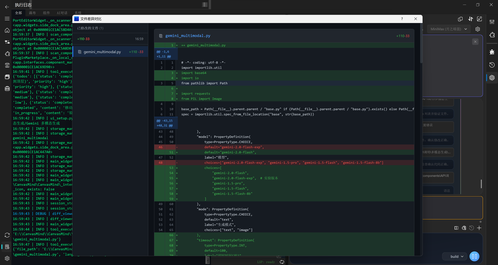
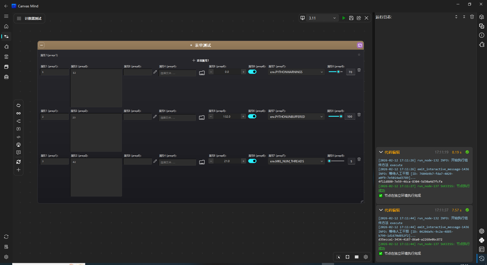
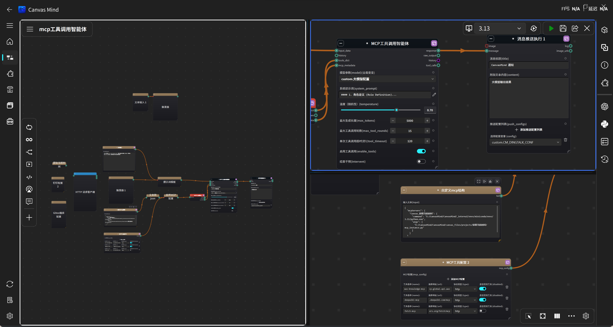

<!-- README.md -->
<p align="center">
  
</p>

<div align="center">
  <h1>Visual Programming Platform for Algorithm & AI Workflow Development</h1>

  [🇨🇳 中文](README_zh.md) | [🇬🇧 English](README.md) | [📘 Documentation](https://canvasmind-sphinx-build.readthedocs.io/zh-cn/latest/) | [🎥 Demo Video](https://www.bilibili.com/video/BV153zCBGEU2)

</div>

<div align="center">


</div>

A modern low-code visual programming platform built on **NodeGraphQt** and **qfluentwidgets**, supporting drag-and-drop component orchestration, asynchronous execution, file operations, control flow logic, and one-click export of workflows into standalone, executable projects—enabling seamless transition from development to deployment.

<br>

<br>

<br>

<br>

<br>

---

## 🌟 Why Choose CanvasMind?

| Traditional Low-Code Tools                    | CanvasMind |
|-----------------------------------------------|-----------|
| Static component assembly                     | **Dynamic expressions + global variables** drive parameters |
| Only serial execution                         | Full **conditional branching, iteration, and loops** |
| No custom logic                               | **Embedded code editor** for writing Python components freely |
| Execution = endpoint                          | **One-click export** to standalone projects (API, CLI, Docker) |
| AI disconnected from canvas                   | **Deep LLM integration**: yellow jump / purple create buttons for canvas-aware intelligent completion |
| Fixed Runtime Environment                     | Supports remote execution via SSH: Features integrated Python environment management for SSH servers and supports dispatching nodes to the server-side for execution. |
| No Trigger Node or Hard-coded Trigger Options | Extensible Plugin Trigger System: Decoupled architecture allowing dynamic loading of Cron, Webhook, and File-watchers; UI auto-syncs with backend logic |

---

## 🌟 Key Features

### 📋 Complex Form & Tree Control Widget 🌳
*   **Dynamic Property Grid** – Render adaptive UI controls (text fields, numeric inputs, file selectors, toggles, sliders) based on parameter data types and validation rules
*   **Hierarchical Property Tree** – Organize nested configurations into expandable/collapsible tree structures with drag-and-drop reordering for complex workflows
*   **Context-Aware Validation** – Apply real-time validation logic based on parameter dependencies (e.g., enabling/disabling fields based on toggle states)
*   **Interactive Tree Navigation** – Context menus and visual indicators for managing parent-child relationships in hierarchical data structures

<br>

### 🪟 Multi-View Splitting 🛰️
*   **Recursive Viewport Splitting** – Split the canvas horizontally or vertically to monitor distant parts of a large-scale graph simultaneously.
*   **Synchronized Scene State** – All viewports share the same live scene. Editing a node in one view reflects instantly across all others, enabling high-efficiency cross-node referencing.
*   **Distant Node Tracking** – Ideal for complex pipelines where you need to watch the "Source Node" parameters in one view while observing the "Terminal Output" behavior in another.

<br>

### ⚡ Distributed & Hybrid Execution Engine
*   **Parallel DAG Execution** – Independent branches are executed concurrently via a high-performance task scheduler, maximizing CPU/GPU utilization across the workflow.
*   **Hybrid Runtime Orchestration** – Supports seamless mixing of execution environments:
    *   **Interactive IPython Kernel**: Leveraging local persistent sessions for rapid debugging and state retention.
    *   **Remote SSH Workers**: Transparently dispatching heavy-compute nodes (e.g., Model Training/Inference) to high-performance servers with automated environment syncing.
*   **Selective In-Memory Persistence (Caching)** – Users can toggle "Pin to Memory" for specific nodes; results are cached in the active process RAM to eliminate redundant re-computation and I/O overhead during iterative tuning.
*   **Intelligent Topological Dispatch** – Automatically resolves dependencies and routes tasks to the optimal target (Local/Remote/IPython) based on node configuration.
*   **Unified State Management** – Real-time visualization of node status (Queued / Running / Success / Failed) across all distributed workers on a single canvas.
*   **High-Speed Data Serialization** – Utilizes `pyarrow` and `pickle` for low-latency data transfer between local and remote environments.

### 🧠 Intelligent Node Recommendation ✨
- **Type-Aware Suggestions** – Automatically match compatible downstream components based on output port types  
- **Multi-Port Grouping** – Recommendations grouped by source port for clarity  
- **Visual Differentiation** – Color-coded suggestions per port type  
- **Cross-Canvas Learning** – Tracks component connection frequency to improve recommendations over time  

### 🤖 LLM-Chatter: Intelligent Coding Assistant
A powerful built-in coding assistant with OpenCode-style agent architecture and comprehensive tool system.

#### 🧠 Agent System
- **Multi-Agent Support**: Primary agents for main tasks, Subagents for parallel subtasks, Hidden agents for background operations
- **Permission System**: Fine-grained tool permission control per agent (allow/deny/ask)
- **Flexible Configuration**: Define agents via Markdown (YAML frontmatter) or YAML files
- **Agent Profiles**: Support for custom temperature, top_p, max_steps, model selection per agent

#### 🛠️ Comprehensive Tool Suite (30+ Tools)
| Category | Tools |
|----------|-------|
| **File Operations** | `read`, `write`, `edit`, `multiedit`, `patch`, `grep`, `glob`, `list`, `diff_files` |
| **Terminal** | `bash`, `run_verify` |
| **Web** | `webfetch`, `websearch` |
| **Code Analysis** | `get_diagnostics` (Python/JS/TS/Shell) |
| **Task Management** | `todowrite`, `todoread`, `ask_question` |
| **Skills** | `skill`, `list_skills`, `scan_repo`, `stage_files` |
| **Memory** | `memory_list`, `memory_search`, `memory_save`, `memory_consolidate` |
| **Canvas Integration** | `list_webhooks`, `trigger_webhook` |
| **Sub-Agents** | `task` (distribute work to build/plan/skillful/explore agents) |

#### 💾 Long-Term Memory System
- **Persistent Context**: Save key facts across sessions with confidence scores
- **Conflict Management**: Group memories to auto-suppress outdated information
- **Category-based Organization**: Task preferences, project constraints, user habits
- **Auto-Consolidation**: Extract important facts from conversations automatically

#### 🎨 Canvas-Aware Integration
- **Canvas Tools**: Run nodes, get logs, create nodes, connect ports, set properties, edit property strings
- **Context Injection**: Automatic canvas image + node structure + global variables
- **Yellow Jump Buttons**: Click to navigate to referenced nodes on canvas
- **Purple Create Buttons**: One-click instantiation of recommended components
- **Execution State**: Query running tasks, failed nodes, logs in real-time

#### ✨ Advanced Features
- **Conversation Preview**: Rich message cards with code syntax highlighting
- **Context Usage Ring**: Visual token budget monitoring
- **History Management**: Search past conversations, auto-summarize topics
- **File Undo Preview**: Review changes before applying via diff viewer
- **Tool Floating Panel**: Real-time tool call status display
- **Sub-Agent Manager**: Coordinate parallel task execution

### 🔁 Advanced Control Flow ✨
- **Conditional Branching** – Enable/disable branches based on `$...$` expressions (`if/else` logic)  
- **Iteration** – Loop over lists or arrays, executing subgraphs per element  
- **Loop Control** – Fixed-count or condition-driven loops  
- **Dynamic Subgraph Skipping** – Entire downstream subgraphs of inactive branches are skipped for efficiency  
- **Expression-Driven Logic** – Branch conditions, loop counts, etc., support dynamic expressions  

### 🌐 Global Variables & Expression System ✨
- **Structured Scopes** – Three variable scopes: `env` (environment), `custom` (user-defined), and `node_vars` (node outputs)  
- **Dynamic Expressions** – Use `$env_user_id$` or `$custom_threshold * 2$` in any parameter field  
- **Runtime Evaluation** – Expressions resolved before execution, with support for nested dicts/lists  
- **Secure Sandbox** – Powered by `asteval`; prevents unsafe operations and isolates environments via `contextmanager`  
- **UI Integration** – Select variables or type expressions directly in component property panels  

### ✅ Dynamic Code Components
- **Full Python Logic** – Write complete `run()` methods and helper functions inside nodes  
- **Dynamic Ports** – Add/remove input/output ports via UI; bind global variables as defaults  
- **Full Feature Integration** – Leverages global variables, expressions, auto-dependency install, logging, and status visualization  
- **Safe Execution** – Runs in isolated subprocesses with timeout control, error capture, and retry support  
- **Developer-Friendly Editor** – Professional code editor with dark theme, syntax highlighting, intelligent autocomplete, folding, and error diagnostics  

### ⚡ Plugin-based Trigger System

* **Dynamic Plugin Loading** – Decoupled architecture that automatically discovers and registers new trigger types (Cron, Webhook, File Watcher) from the plugin directory without restarting.
* **Auto-Adaptive UI** – Node property panels dynamically reconstruct their input widgets based on the selected plugin, ensuring a clean, context-aware interface.
* **Event-Driven Execution** – Transition from manual execution to automated workflows by reacting to external HTTP requests, schedule patterns, or file system changes.
* **Lifecycle Management** – Built-in safety logic that automatically unregisters backend listeners when a canvas is closed or a node is deleted to prevent resource leaks.

### 📊 Node Management
- **Dynamic Loading** – Auto-scans `components/` directory and loads new components  
- **Pydantic Schemas** – Define inputs, outputs, and properties using Pydantic models  
- **Per-Node Logging** – Each node maintains its own execution log  
- **State Persistence** – Save/load entire workflows  
- **Auto Dependency Resolution** – Components declare `requirements`; missing packages are auto-installed at runtime  

### 📦 Model Export & Standalone Deployment ✨
- **Subgraph Export** – Select any group of nodes and export as a self-contained project  
- **Train/Inference Separation** – Export only inference logic with trained models bundled  
- **Zero-Dependency Runtime** – Generated project runs independently—no CanvasMind required  
- **Multi-Environment Support** – Auto-generated `requirements.txt` enables deployment to servers, Docker, or CLI environments  

### 🛠️ Exported Project Tool Integration
- **Direct Invocation** – Canvas can call exported project scripts by name and retrieve results  
- **Parameter Passing** – Node properties define tool-call parameters, passed automatically at runtime  
- **Full Logging** – Detailed logs of tool execution are captured and returned for debugging  
- **LLM Function Calling Ready** – Standardized tool name, input/output schema, and examples for seamless LLM integration  

---

## 🚀 Quick Start

### Prerequisites
- Python 3.8+
- PyQt5 or PySide6

### Installation

```bash
# Clone the repository
git clone https://github.com/martin98-afk/CanvasMind.git
cd CanvasMind

# Create virtual environment (recommended)
python -m venv .venv

# Activate virtual environment
# Linux/Mac:
source .venv/bin/activate
# Windows:
.venv\Scripts\activate

# Install dependencies
pip install -r requirements.txt
```

### Run

```bash
python main.py
```

### Build (Optional)

```bash
python build.py
```

---

## 🧪 Component Development

### Supported Port Types

| Type              | Description         | Example                   |
|-------------------|---------------------|---------------------------|
| `TEXT`            | Text input          | String parameters         |
| `LONGTEXT`        | Long text input     | Multi-line strings        |
| `INT`             | Integer             | Numeric values            |
| `FLOAT`           | Floating point      | Decimal numbers           |
| `BOOL`            | Boolean             | Toggle switches           |
| `CSV`             | CSV list data       | Column selections         |
| `JSON`            | JSON structure      | Dynamic nested data       |
| `EXCEL`           | Excel data          | Cell ranges               |
| `FILE`            | File path           | Local file reference      |
| `UPLOAD`          | Document upload     | User-uploaded files       |
| `SKLEARNMODEL`    | Scikit-learn model  | Trained `.pkl` models     |
| `TORCHMODEL`      | PyTorch model       | `.pt` or `.pth` models    |
| `IMAGE`           | Image data          | Base64 or file paths      |

### Supported Property Types

| Type            | Description     | Example                |
|-----------------|-----------------|------------------------|
| `TEXT`          | Text input      | Short strings          |
| `LONGTEXT`      | Long text input | Code snippets, prompts |
| `INT` / `FLOAT` | Numeric input   | Thresholds, counts     |
| `BOOL`          | Toggle          | Enable/disable flags   |
| `CHOICE`        | Dropdown        | Predefined options     |
| `DYNAMICFORM`   | Dynamic form    | Variable-length lists  |
| `RANGE`         | Numeric range   | Min/max sliders        |
| `VARIABLE`      | variable selector | global_variable        | 
| `FILE SELECT`   | Select file     | canvas_files/model.pth    |
---

## 🎮 Canvas Usage Guide

### Basic Operations
1. **Create Node** – Drag from left panel to canvas  
2. **Connect Nodes** – Drag from output port to input port  
3. **Run Node** – Right-click → "Run This Node"  
4. **View Logs** – Right-click → "View Node Logs"  

### Advanced Features
- **Loops** – Use Loop/Iterate nodes with Backdrop for structured iteration  
- **File Handling** – Click file picker in property panel  
- **Workflow Management** – Save/load via top-left buttons  
- **Node Grouping** – Select multiple nodes → right-click → "Create Backdrop"  
- **Dependency Management** – Failed components auto-install missing `requirements`  

### Keyboard Shortcuts
- `Ctrl+R` – Run workflow  
- `Ctrl+S` – Save workflow  
- `Ctrl+O` – Load workflow  
- `Ctrl+A` – Select all nodes  
- `Del` – Delete selected nodes  

---

## 🛠️ Development Notes

### Node Status Colors
- **Idle** – Gray border  
- **Running** – Blue border  
- **Success** – Green border  
- **Failed** – Red border  

### Connection Line Colors
- **Idle** – Yellow  
- **Input Active** – Blue  
- **Output Active** – Green  

### Logging System
- Each node has independent logs with timestamps  
- Powered by **Loguru** – use `self.logger` in components  
- All `print()` output is automatically captured  

### Dataflow
- Inputs auto-populated from upstream outputs  
- Outputs stored by port name  
- Full multi-input/multi-output support  

---

## 📥 Model Export (Standalone Deployment)

### Core Value
Export **any subgraph as a self-contained project** that runs in any Python environment—no CanvasMind required.

### Use Cases
- **Train/Inference Split** – Export only inference logic with models bundled  
- **Team Sharing** – Share full workflows as runnable projects  
- **Production Deployment** – Run on servers or in Docker  
- **Offline Execution** – CLI-only environments  

### Export Features
✅ **Smart Dependency Analysis** – Copies only necessary component code  
✅ **Path Rewriting** – Model/data files copied and converted to relative paths  
✅ **Column Selection Preserved** – CSV column config fully retained  
✅ **Environment Isolation** – Auto-generated `requirements.txt`  
✅ **Ready-to-Run** – Includes `run.py` and `api_server.py`  

### Export Steps
1. **Select Nodes** – Choose any nodes on canvas (multi-select supported)  
2. **Click Export** – Top-left **"Export Model"** button (📤 icon)  
3. **Choose Directory** – Project folder auto-generated  
4. **Run Externally**:

```bash
# Install dependencies
pip install -r requirements.txt

# Run model
python run.py
```

### Exported Project Structure
```
model_xxxxxxxx/
├── model.workflow.json    # Full workflow definition (nodes, connections, column selections)
├── project_spec.json      # Input/output schema
├── preview.png            # Canvas preview snapshot
├── README.md              # Project overview
├── requirements.txt       # Auto-analyzed dependencies
├── run.py                 # CLI entrypoint
├── api_server.py          # FastAPI microservice
├── scan_components.py     # Component loader
├── runner/
│   ├── component_executor.py
│   └── workflow_runner.py
├── components/            # Original component code (preserved structure)
│   ├── base.py
│   └── your_components/
└── inputs/                # Bundled models/data files
```

---

## 🗺️ Roadmap

| Status | Feature |
|--------|---------|
| 🚧 In Progress | Code-to-canvas auto-creation (from editor → new node) |
| 📋 Planned | Enhanced visualization for large-scale workflows |
| 📋 Planned | Cloud execution support |

---

## 🤝 Contributing

Contributions are welcome! Please feel free to submit a Pull Request.

### Development Setup

```bash
# 1. Fork and clone the repository
git clone https://github.com/martin98-afk/CanvasMind.git
cd CanvasMind

# 2. Create a virtual environment
python -m venv .venv
source .venv/bin/activate  # Linux/Mac
.venv\Scripts\activate     # Windows

# 3. Install dependencies
pip install -r requirements.txt

# 4. Run in development mode
python main.py

# 5. Run tests (if available)
pytest
```

### Pull Request Process

1. Fork the repository
2. Create your feature branch (`git checkout -b feature/AmazingFeature`)
3. Commit your changes (`git commit -m 'Add some AmazingFeature'`)
4. Push to the branch (`git push origin feature/AmazingFeature`)
5. Open a Pull Request

---

## 📖 Documentation

For full documentation, visit: [CanvasMind Docs](https://canvasmind-sphinx-build.readthedocs.io/zh-cn/latest/)

---

## 💬 Get Help

- 📋 [Open an Issue](https://github.com/martin98-afk/CanvasMind/issues) - Report bugs or request features
- 💬 [Discussions](https://github.com/martin98-afk/CanvasMind/discussions) - Ask questions and share ideas

---

## 📄 License

This project is licensed under the [GPLv3 License](LICENSE).

---

## 🙏 Acknowledgements

- [NodeGraphQt](https://github.com/jchanvfx/NodeGraphQt) – Node graph framework  
- [PyQt-Fluent-Widgets](https://github.com/zhiyiYo/PyQt-Fluent-Widgets) – Fluent Design UI library  
- [Loguru](https://github.com/Delgan/loguru) – Elegant Python logging

---

## Star History

<a href="https://www.star-history.com/?repos=martin98-afk%2FCanvasMind&type=date&legend=top-left">
 <picture>
   <source media="(prefers-color-scheme: dark)" srcset="https://api.star-history.com/chart?repos=martin98-afk/CanvasMind&type=date&theme=dark&legend=top-left&sealed_token=w4iihSZInbJcfwyBCqmC3UavHQzwoNwKIA1JjM8b4AKUhHB79BddMojMJLqDo_O1rNXAlSUA--_B4GdN4WTWYFXydgD7rw-NefliCkY39Fn67zejp9u9q8Rqcz3_oehjfv1dd6tG1-NNL19GRpL8R6-uVE6lIoi2ih37_r87VmCoccGO6C-HwlMZvmDc" />
   <source media="(prefers-color-scheme: light)" srcset="https://api.star-history.com/chart?repos=martin98-afk/CanvasMind&type=date&legend=top-left&sealed_token=w4iihSZInbJcfwyBCqmC3UavHQzwoNwKIA1JjM8b4AKUhHB79BddMojMJLqDo_O1rNXAlSUA--_B4GdN4WTWYFXydgD7rw-NefliCkY39Fn67zejp9u9q8Rqcz3_oehjfv1dd6tG1-NNL19GRpL8R6-uVE6lIoi2ih37_r87VmCoccGO6C-HwlMZvmDc" />
   
 </picture>
</a>
