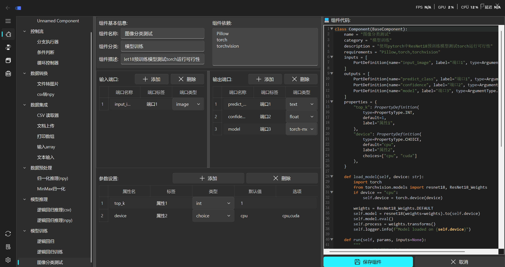
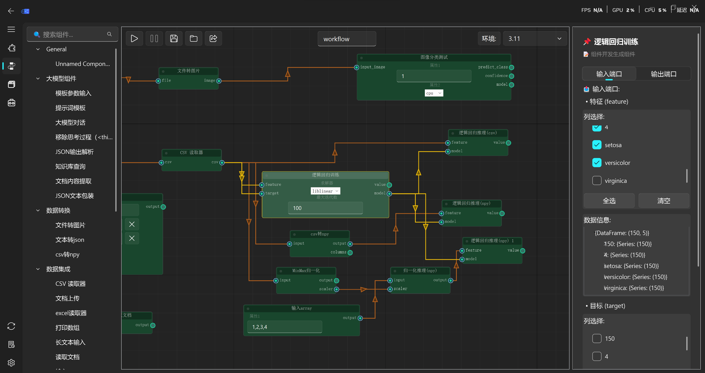
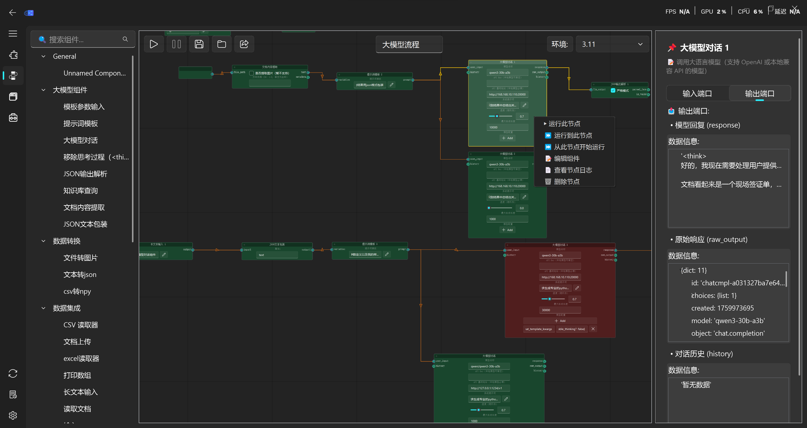
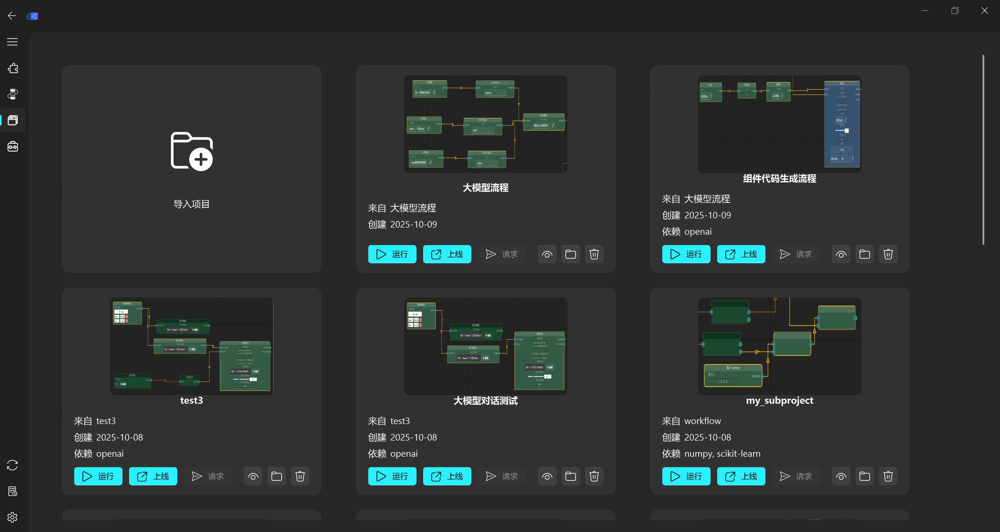

<p align="center">
  
</p>
 
<h1 align="center">
  低代码可视化编程平台
</h1>

<div align="center">


</div>


一个基于 **NodeGraphQt** 和 **qfluentwidgets** 的现代化低代码可视化编程平台，支持拖拽式组件编排、异步执行、文件操作、循环控制，并可将工作流一键导出为独立可运行项目，实现从开发到部署的无缝衔接。
## 📷 组件开发示意图



## 📷 工作流管理界面示意图


## 🎉 工作流示意图






## 📦 子图导出示意图


### 项目管理示意图



### 项目服务日志示意图


## 📦 运行环境管理示意图


## 🌟 主要特性

### 🎨 现代化 UI 界面
- **Fluent Design 风格** - 基于 qfluentwidgets 的现代化界面
- **深色主题** - 护眼的深色主题设计
- **响应式布局** - 适配不同屏幕尺寸

### 🧩 可视化编程
- **拖拽式组件** - 从组件面板拖拽到画布创建节点
- **连线数据流** - 通过连线建立节点间的数据依赖
- **Backdrop 分组** - 使用 Backdrop 节点对相关组件进行视觉分组
- **右键菜单** - 完整的上下文菜单操作

### ⚡ 异步执行引擎
- **非阻塞执行** - 使用 QThreadPool 实现异步执行，避免界面卡死
- **状态可视化** - 节点状态通过颜色实时显示（运行中/成功/失败/未运行）
- **拓扑排序** - 自动检测依赖关系，按正确顺序执行节点
- **循环支持** - 通过循环控制器节点实现循环逻辑

### 📊 节点管理
- **动态组件加载** - 自动扫描 components 目录，动态加载组件
- **Pydantic 配置** - 使用 Pydantic 模型定义组件输入/输出/属性
- **独立日志系统** - 每个节点独立存储执行日志
- **状态持久化** - 支持工作流的导入/导出
- **依赖管理** - 组件可定义 `requirements` 字段，运行时自动安装缺失包

### 📦 模型导出与独立部署 ✨
- **子图导出** - 选中任意节点组合，一键导出为独立项目
- **训练/推理分离** - 仅导出推理流程，自动打包训练好的模型文件
- **自包含运行** - 生成完整可执行项目，无需主程序即可运行
- **跨环境部署** - 自动生成工具包要求，支持服务器、Docker、命令行等无 GUI 环境

## 🚀 快速开始

### 环境要求
- Python 3.8+
- PyQt5 或 PySide2

### 安装依赖
```bash
pip install -r requirements.txt
```

### 运行应用
```bash
python main.py
```

### pyinstaller打包应用
```bash
pyinstaller --onedir --windowed --add-data "app;app" --add-data "icons;icons" -i icons/logo3.png main.py
```

## 🧪 组件开发

### 创建新组件

1. **在 `components/` 目录下创建组件文件**

```python
# components/data/my_component.py
import importlib.util
import pathlib
base_path = pathlib.Path(__file__).parent.parent / "base.py"
spec = importlib.util.spec_from_file_location("base", str(base_path))
base_module = importlib.util.module_from_spec(spec)
spec.loader.exec_module(base_module)

# 导入所需项目
BaseComponent = base_module.BaseComponent
PortDefinition = base_module.PortDefinition
PropertyDefinition = base_module.PropertyDefinition
PropertyType = base_module.PropertyType
ArgumentType = base_module.ArgumentType

class Component(BaseComponent):
    name = "我的组件"
    category = "数据处理"
    description = "这是一个示例组件"
    # --- 新增：定义组件依赖 ---
    requirements = "pandas~=1.3.0,numpy,scikit-learn"

    inputs = [
        PortDefinition(name="input_data", label="输入数据", type=ArgumentType.FILE)
    ]

    outputs = [
        PortDefinition(name="output_data", label="输出数据", type=ArgumentType.CSV),
        PortDefinition(name="result", label="结果", type=ArgumentType.TEXT)
    ]

    properties = {
        "parameter1": PropertyDefinition(
            type=PropertyType.TEXT,
            default="default_value",
            label="参数1"
        ),
        "max_count": PropertyDefinition(
            type=PropertyType.INT,
            default=10,
            label="最大数量"
        )
    }

    def run(self, params, inputs=None):
        # 组件逻辑
        input_data = inputs.get("input_data") if inputs else "default"
        param1 = params.get("parameter1", "default")
        max_count = int(params.get("max_count", 10))

        # 处理逻辑...
        result_data = f"{input_data}_{param1}_{max_count}"

        return {
            "output_data": "/path/to/output.csv",  # 文件路径
            "result": result_data  # 文本结果
        }
```

2. **自动加载** - 组件会自动被扫描并添加到组件面板
3. **自动依赖安装** - 当运行工作流时，如果该组件因缺少依赖包而执行失败，系统会根据 `requirements` 字段自动安装所需包，然后重试执行。

### 组件类型支持

| 类型 | 说明 | 示例 |
|------|------|------|
| `TEXT` | 文本输入 | 字符串参数 |
| `INT` | 整数输入 | 数值参数 |
| `FLOAT` | 浮点数输入 | 小数参数 |
| `BOOL` | 布尔输入 | 开关选项 |
| `CHOICE` | 下拉选择 | 预定义选项 |
| `FILE` | 文件路径 | 任意文件 |
| `FOLDER` | 文件夹路径 | 目录选择 |
| `CSV` | CSV文件 | CSV文件选择 |
| `JSON` | JSON文件 | JSON文件选择 |

## 🎮 画布使用指南

### 基本操作
1. **创建节点** - 从左侧组件面板拖拽组件到画布
2. **连接节点** - 从输出端口拖拽到输入端口
3. **运行节点** - 右键点击节点选择"运行此节点"
4. **查看日志** - 右键点击节点选择"查看节点日志"

### 高级功能
1. **循环执行** - 使用循环控制器节点配合 Backdrop 实现循环
2. **文件操作** - 在属性面板中点击文件选择按钮
3. **工作流管理** - 使用左上角按钮保存/加载工作流
4. **节点分组** - 选中多个节点右键创建 Backdrop
5. **依赖管理** - 组件运行失败时，系统会根据其 `requirements` 尝试自动安装。

### 快捷键
- `Ctrl+R` - 运行工作流
- `Ctrl+S` - 保存工作流  
- `Ctrl+O` - 加载工作流
- `Ctrl+A` - 全选节点
- `Del` - 删除选中节点

## 🛠️ 画布开发说明

### 节点状态管理
- **未运行** - 灰色框
- **运行中** - 蓝色框  
- **执行成功** - 绿色框
- **执行失败** - 红色框

### 日志系统
- 每个节点独立存储日志
- 自动添加时间戳
- 支持 Loguru 日志库，组件内部使用 `self.logger` 记录日志
- 组件内部 `print()` 输出自动捕获

### 数据流
- 输入端口自动获取上游节点输出
- 输出端口数据按端口名称存储
- 支持多输入多输出

## 📥 模型导出（独立部署）

### 核心价值
**将画布上的任意子图导出为可独立运行的项目**，无需依赖主程序即可部署到任何 Python 环境！

### 使用场景
- **训练/推理分离**：只导出推理部分，打包训练好的模型文件
- **模型分享**：将完整工作流打包分享给同事
- **生产部署**：直接部署到服务器或 Docker 容器
- **离线运行**：在无 GUI 环境中执行工作流

### 导出功能特点
✅ **智能依赖分析** - 自动识别并复制所需组件代码  
✅ **文件路径重写** - 模型文件、数据文件自动复制到项目目录并重写为相对路径  
✅ **列选择支持** - CSV 列选择配置完整保留  
✅ **环境隔离** - 自动生成 `requirements.txt`，确保依赖一致性  
✅ **即开即用** - 包含完整运行脚本，无需额外配置

### 导出步骤
1. **选择节点** - 在画布上选中要导出的节点（可多选）
2. **点击导出** - 点击左上角 **"导出模型"** 按钮（📤 图标）
3. **选择目录** - 选择导出目录，系统自动生成项目文件夹
4. **运行项目** - 进入导出目录，执行以下命令：

```bash
# 安装依赖
pip install -r requirements.txt

# 运行模型
python run.py
```

### 导出项目结构
```
model_xxxxxxxx/
├── model.workflow.json    # 工作流定义（包含节点配置、连接关系、列选择等）
├── requirements.txt       # 自动分析的依赖包列表
├── run.py                 # 一键运行脚本
├── scan_components.py     # 组件扫描器
├── runner/                # 执行器模块
│   ├── component_executor.py
│   └── workflow_runner.py # 工作流执行引擎
├── components/            # 组件代码（保持原始目录结构）
│   ├── base.py           # 组件基类
│   └── your_components/  # 你的组件文件
└── inputs/                # 输入文件（模型文件、数据文件等）
```


## 功能实现情况
- [x] 组件管理
- [x] 组件开发
- [ ] 逻辑控制预制组件
  - [x] 逻辑判断
  - [ ] 当如果就
  - [ ] 循环
  - [ ] 迭代
- [ ] 组件调试
- [x] 组件参数
  - [x] CSV 参数
    - [x] CSV 参数信息预览
    - [x] CSV 参数列选择
    - [ ] CSV 数据分析
  - [x] EXCEL 参数
  - [x] SKLEARN 参数
  - [x] Torch 参数
  - [x] NUMPY 参数
  - [x] IMAGE 参数
  - [x] JSON 参数
  - [x] TEXT 参数
  - [x] FILE 参数
- [x] 组件输入端口校验
- [x] 组件运行
- [x] 组件日志
- [x] 组件分组
- [x] 组件预览
  - [x] 节点拖拽预览
- [x] 模型管理
  - [x] 模型画布预览图
- [x] 模型运行
  - [x] 运行环境切换
  - [x] 三种运行模式
- [x] 画布导出
  - [x] 模型画布保存
  - [x] 模型输出结果保存
- [x] 画布导入
  - [x] 模型画布导入
  - [x] 模型输出结果导入
- [x] 模型导出
  - [x] 导出独立模型项目
  - [x] 自动检测依赖包
  - [x] 导出项目可运行性检测
  - [x] 自动包装API接口
  - [ ] 自动生成API文档
  - [x] API 输入输出节点定义
- [x] 模型运行环境控制
  - [x] 安装包安装、强制重装、更新、卸载
  - [x] 组件安装包同步
  - [x] 多运行环境管理
  - [x] 运行环境切换
  - [x] 工具包列表信息
  - [x] 安装实时日志
- [x] 输出节点预览
- [ ] 输出节点变量下载
- [x] 工具配置
- [x] 组件依赖管理 (requirements)

## 🤝 贡献指南

1. Fork 本项目
2. 创建 feature 分支 (`git checkout -b feature/AmazingFeature`)
3. 提交代码 (`git commit -m 'Add some AmazingFeature'`)
4. 推送到分支 (`git push origin feature/AmazingFeature`)
5. 创建 Pull Request

## 📄 许可证

本项目采用 [GPLv3 许可证](LICENSE)。

## 🙏 致谢

- [NodeGraphQt](https://github.com/jchanvfx/NodeGraphQt    ) - 节点图框架
- [qfluentwidgets](https://github.com/zhiyiYo/PyQt-Fluent-Widgets    ) - Fluent Design 组件库
- [Loguru](https://github.com/Delgan/loguru    ) - Python 日志库
