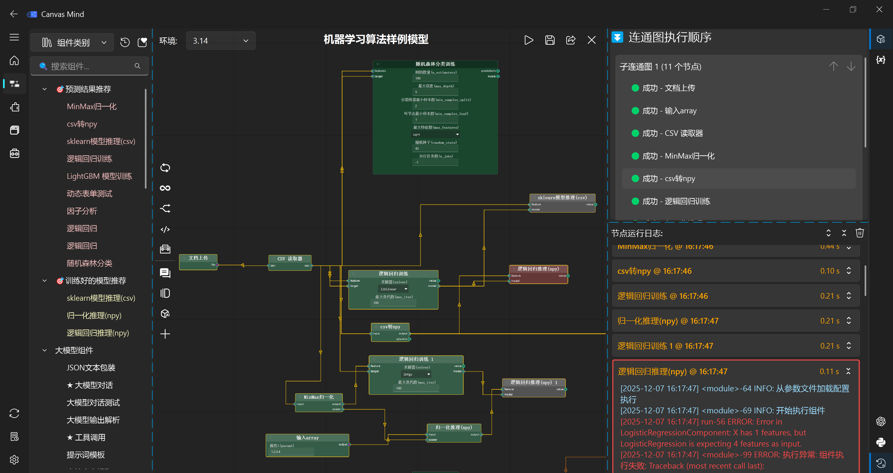

<!-- README_zh.md -->
<p align="center">
  
</p>
 
<div align="center">
  <h1>可视化编程流程算法开发工具</h1>
  
  [🇨🇳 中文](README_zh.md) | [🇬🇧 English](README.md)| [📘 使用手册](https://canvasmind-sphinx-build.readthedocs.io/zh-cn/latest/)
</div>

<div align="center">


</div>


一个基于 **NodeGraphQt** 和 **qfluentwidgets** 的现代化低代码可视化编程平台，支持拖拽式组件编排、异步执行、文件操作、循环控制，并可将工作流一键导出为独立可运行项目，实现从开发到部署的无缝衔接。

<br>

---

## 🌟 为什么选择 CanvasMind？

| 传统低代码工具 | CanvasMind |
|----------------|-----------|
| 静态组件拼接 | **动态表达式 + 全局变量** 驱动参数 |
| 仅支持串行执行 | **条件分支 + 迭代 + 循环** 控制流 |
| 无法自定义逻辑 | **内嵌代码编辑器**，自由编写 Python 组件 |
| 执行即终点 | **一键导出独立项目**，支持 API、命令行、Docker 部署 |
| AI 与画布割裂 | **大模型深度集成**：黄色跳转 / 紫色创建，实现画布级智能补全（⭐ 未来）|

---

## 🌟 主要特性

### 🎨 现代化 UI 界面
- **Fluent Design 风格** - 基于 qfluentwidgets 的现代化界面  
- **深色主题** - 护眼的深色主题设计  
- **响应式布局** - 适配不同屏幕尺寸  

### 🧩 可视化编程
- **拖拽式组件** - 从组件面板拖拽到画布创建节点  
- **连线数据流** - 通过连线建立节点间的数据依赖  
- **Backdrop 分组** - 使用 Backdrop 节点对相关组件进行视觉分组  
- **右键菜单** - 完整的上下文菜单操作  

### 🧠 智能节点补全推荐 ✨（新增）
- **类型兼容推荐** - 基于输出端口 ArgumentType 自动匹配兼容的下游组件
- **多端口分组** - 按输出端口分组显示推荐项，清晰展示推荐来源
- **视觉区分** - 不同端口的推荐项使用不同颜色高亮，一目了然
- **全局统计学习** - 跨画布记录组件连接频率，越用越聪明

### 🤖 大模型画布上下文联动（已实现）
- **黄色跳转按钮**：大模型回复中引用现有节点时，自动生成 `[节点名](jump)` 黄色按钮，点击直接跳转到画布对应节点；
- **紫色创建按钮**：推荐新组件时，生成 `[组件名](create)` 紫色按钮，点击即从组件库实例化新节点并自动连线；
- **多模态上下文注入**：自动将节点 JSON、变量状态、base64 图片等作为上下文传给大模型，确保建议精准可操作；
- **画布智能补全**：支持同时引用多个现有节点（黄）并推荐多个缺失组件（紫），实现端到端流程补全建议。

### ⚡ 异步执行引擎
- **非阻塞执行** - 使用 QThreadPool 实现异步执行，避免界面卡死  
- **状态可视化** - 节点状态通过颜色实时显示（运行中/成功/失败/未运行）  
- **拓扑排序** - 自动检测依赖关系，按正确顺序执行节点  
- **高效数据序列化方法** - 使用 `pickle` `pyarrow` 模块进行数据对象序列化，提升存储、读取、执行效率

### 🔁 高级控制流支持 ✨（新增）
- **条件分支（Conditional Branch）** - 根据表达式动态启用/禁用分支，实现 `if/else` 逻辑  
- **迭代执行（Iterate）** - 遍历列表/数组，对每个元素执行子流程  
- **循环控制（Loop）** - 支持固定次数或条件驱动的迭代循环  
- **动态禁用** - 未激活分支及其**整个下游子图自动跳过**，提升执行效率  
- **表达式驱动** - 分支条件、循环次数等均支持 `$...$` 动态表达式  

### 🌐 全局变量与表达式系统 ✨
- **结构化全局变量** - 支持环境变量（env）、自定义变量（custom）、节点输出（node_vars）三类作用域，环境变量在组件执行时实时注入
- **动态表达式引擎** - 使用 `$表达式$` 语法在参数中引用和组合变量（如 `$env_user_id$`、`$custom_threshold * 2$`）  
- **实时求值** - 执行前自动解析表达式，支持嵌套结构（列表/字典）中的动态值  
- **安全沙箱** - 基于 `asteval` 的安全执行环境，禁止危险操作，使用 `contextmanager` 实现组件间环境变量隔离
- **属性面板集成** - 在组件属性中可直接选择全局变量或输入表达式  

### ✅ **动态代码组件**  
- **自由编程**：在节点内直接编写完整 Python 组件逻辑（含 `run` 方法及辅助函数）  
- **动态端口**：通过属性表单自由增删输入/输出端口，支持为输入端口绑定**全局变量默认值**  
- **无缝集成**：复用全局变量、表达式系统、依赖自动安装、独立日志、状态可视化等全部核心能力  
- **安全执行**：代码在独立子进程运行，支持超时控制、错误捕获与重试  
- **开发友好**：专业级代码编辑器（深色主题、语法高亮、智能补全、折叠、错误提示）

### 📊 节点管理
- **动态组件加载** - 自动扫描 `components` 目录，动态加载组件  
- **Pydantic 配置** - 使用 Pydantic 模型定义组件输入/输出/属性  
- **独立日志系统** - 每个节点独立存储执行日志  
- **状态持久化** - 支持工作流的导入/导出  
- **依赖管理** - 组件可定义 `requirements` 字段，运行时自动安装缺失包  

### 📦 模型导出与独立部署 ✨
- **子图导出** - 选中任意节点组合，一键导出为独立项目  
- **训练/推理分离** - 仅导出推理流程，自动打包训练好的模型文件  
- **自包含运行** - 生成完整可执行项目，无需主程序即可运行  
- **跨环境部署** - 自动生成工具包要求，支持服务器、Docker、命令行等无 GUI 环境  

### 🛠️ 导出项目画布工具调用
- **工具调用** - 画布可直接根据项目名称调用项目执行脚本，获取运行结果
- **工具调用参数** - 画布节点属性中支持工具调用参数，工具调用时自动传入
- **工具调用日志** - 完整记录并返回详细的工具调用过程与结果日志，便于调试与追踪。
- **大模型集成** - 提供标准化的工具名称、输入/输出参数格式及调用示例，无缝支持大模型的工具调用（Function Calling）能力。

---

## 🚀 快速开始

### 环境要求
- Python 3.8+
- PyQt5 或 PySide2

### 安装依赖
```bash
pip install -r requirements.txt
```

### 运行应用
```bash
python main.py
```

### pyinstaller打包应用
```bash
pyinstaller --onedir --windowed --add-data "app;app" --add-data "icons;icons" -i icons/logo3.png main.py
```

---

## 🧪 组件开发

### 创建新组件

1. **在 `components/` 目录下创建组件文件**

```python
# components/data/my_component.py
class Component(BaseComponent):
    name = ""
    category = ""
    description = ""
    requirements = ""
    inputs = [
    ]
    outputs = [
    ]
    properties = {
    }

    def run(self, params, inputs=None):
        """
        params: 节点属性（来自UI）
        inputs: 上游输入（key=输入端口名）
        return: 输出数据（key=输出端口名）
        """
        # 在这里编写你的组件逻辑
        input_data = inputs.get("input_data") if inputs else None
        param1 = params.get("param1", "default_value")
        # 处理逻辑
        result = f"处理结果: {input_data} + {param1}"
        return {
            "output_data": result
        }

```

2. **自动加载** - 组件会自动被扫描并添加到组件面板
3. **自动依赖安装** - 当运行工作流时，如果该组件因缺少依赖包而执行失败，系统会根据 `requirements` 字段自动安装所需包，然后重试执行。


### 组件端口参数支持

| 类型         | 说明      | 示例         |
|------------|---------|------------|
| `TEXT`     | 文本输入    | 字符串参数      |
| `LONGTEXT` | 长文本输入   | 字符串参数      |
| `INT`      | 整数输入    | 数值参数       |
| `FLOAT`    | 浮点数输入   | 小数参数       |
| `BOOL`     | 布尔输入    | 开关选项       |
| `CSV`      | csv列表数据 | 预定义选项      |
| `JSON`     | json结构数据 | 不定长度数据列表信息 |
| `EXCEL`    | excel列表数据 | 指定范围的数值    |
| `FILE`    | 文本数据    | 指定范围的数值    |
| `UPLOAD`    | 上传文档    | 指定范围的数值    |
| `SKLEARNMODEL`    | sklearn模型 | 指定范围的数值    |
| `TORCHMODEL`    | torch模型 | 指定范围的数值    |
| `IMAGE`    | 图片数据    | 指定范围的数值    |

### 组件属性参数支持

| 类型            | 说明     | 示例         |
|---------------|--------|------------|
| `TEXT`        | 文本输入   | 字符串参数      |
| `LONGTEXT`    | 长文本输入  | 字符串参数      |
| `INT`         | 整数输入   | 数值参数       |
| `FLOAT`       | 浮点数输入  | 小数参数       |
| `BOOL`        | 布尔输入   | 开关选项       |
| `CHOICE`      | 下拉选择   | 预定义选项      |
| `DYNAMICFORM` | 动态表单   | 不定长度数据列表信息 |
| `RANGE`       | 数值范围   | 指定范围的数值    |

---

## 🎮 画布使用指南

### 基本操作
1. **创建节点** - 从左侧组件面板拖拽组件到画布
2. **连接节点** - 从输出端口拖拽到输入端口
3. **运行节点** - 右键点击节点选择"运行此节点"
4. **查看日志** - 右键点击节点选择"查看节点日志"

### 高级功能
1. **循环执行** - 使用循环控制器节点配合 Backdrop 实现循环
2. **文件操作** - 在属性面板中点击文件选择按钮
3. **工作流管理** - 使用左上角按钮保存/加载工作流
4. **节点分组** - 选中多个节点右键创建 Backdrop
5. **依赖管理** - 组件运行失败时，系统会根据其 `requirements` 尝试自动安装。

### 快捷键
- `Ctrl+R` - 运行工作流
- `Ctrl+S` - 保存工作流  
- `Ctrl+O` - 加载工作流
- `Ctrl+A` - 全选节点
- `Del` - 删除选中节点

---

## 🛠️ 画布开发说明

### 节点状态管理
- **未运行** - 灰色框
- **运行中** - 蓝色框  
- **执行成功** - 绿色框
- **执行失败** - 红色框

### 连接线状态管理
- **未运行** - 黄色线
- **运行中输入连接** - 蓝色线
- **运行中输出连接** - 绿色线

### 日志系统
- 每个节点独立存储日志
- 自动添加时间戳
- 支持 Loguru 日志库，组件内部使用 `self.logger` 记录日志
- 组件内部 `print()` 输出自动捕获

### 数据流
- 输入端口自动获取上游节点输出
- 输出端口数据按端口名称存储
- 支持多输入多输出

---

## 📥 模型导出（独立部署）

### 核心价值
**将画布上的任意子图导出为可独立运行的项目**，无需依赖主程序即可部署到任何 Python 环境！

### 使用场景
- **训练/推理分离**：只导出推理部分，打包训练好的模型文件
- **模型分享**：将完整工作流打包分享给同事
- **生产部署**：直接部署到服务器或 Docker 容器
- **离线运行**：在无 GUI 环境中执行工作流

### 导出功能特点
✅ **智能依赖分析** - 自动识别并复制所需组件代码  
✅ **文件路径重写** - 模型文件、数据文件自动复制到项目目录并重写为相对路径  
✅ **列选择支持** - CSV 列选择配置完整保留  
✅ **环境隔离** - 自动生成 `requirements.txt`，确保依赖一致性  
✅ **即开即用** - 包含完整运行脚本，无需额外配置

### 导出步骤
1. **选择节点** - 在画布上选中要导出的节点（可多选）
2. **点击导出** - 点击左上角 **"导出模型"** 按钮（📤 图标）
3. **选择目录** - 选择导出目录，系统自动生成项目文件夹
4. **运行项目** - 进入导出目录，执行以下命令：

```bash
# 安装依赖
pip install -r requirements.txt

# 运行模型
python run.py
```

### 导出项目结构
```
model_xxxxxxxx/
├── model.workflow.json    # 工作流定义（包含节点配置、连接关系、列选择等）
├── preject_spec.json      # 项目输入输出定义信息
├── preview.png            # 项目导出时画布节点预览图
├── REAMDME.md             # 项目信息展示
├── requirements.txt       # 自动分析的依赖包列表
├── run.py                 # 一键运行脚本
├── api_server.py          # 一键微服务脚本
├── scan_components.py     # 组件扫描器
├── runner/                # 执行器模块
│   ├── component_executor.py
│   └── workflow_runner.py # 工作流执行引擎
├── components/            # 组件代码（保持原始目录结构）
│   ├── base.py           # 组件基类
│   └── your_components/  # 你的组件文件
└── inputs/                # 输入文件（模型文件、数据文件等）
```

---

## 下一步计划

### 1. **持续优化“代码编辑器”**

- **使用lsp服务**：替换现有jedi实现的静态补全机制


### 2. **支持远程执行**

- 将工作流提交到 **远程服务器 / Kubernetes / Ray**
- 本地只做编排，执行在集群
- 适合大模型、大数据场景

### 3. **并行执行**
- 问题：串行执行，无法利用多核
- 优化：
  - 无依赖的节点 并行执行
  - 支持 GPU 资源调度（如 PyTorch 模型分配到不同 GPU）

---

## 📊 功能状态（✅ 已实现｜⏳ 计划中）

- ✅ 可视化画布（NodeGraphQt）
- ✅ 控制流：条件分支 / 循环 / 迭代  
- ✅ 全局变量 + 表达式系统
- ✅ 动态代码组件（内置编辑器）
- ✅ 智能节点推荐
- ✅ 一键导出独立项目（含 API）
- ✅ 多运行环境管理
- ⏳ 大模型上下文联动（黄/紫按钮）
- ⏳ 并行执行 & 远程调度

---

## 🤝 贡献指南

1. Fork 本项目
2. 创建 feature 分支 (`git checkout -b feature/AmazingFeature`)
3. 提交代码 (`git commit -m 'Add some AmazingFeature'`)
4. 推送到分支 (`git push origin feature/AmazingFeature`)
5. 创建 Pull Request

---

## 📄 许可证

本项目采用 [GPLv3 许可证](LICENSE)。

---

## 🙏 致谢

- [NodeGraphQt](https://github.com/jchanvfx/NodeGraphQt    ) - 节点图框架
- [qfluentwidgets](https://github.com/zhiyiYo/PyQt-Fluent-Widgets    ) - Fluent Design 组件库
- [Loguru](https://github.com/Delgan/loguru    ) - Python 日志库
