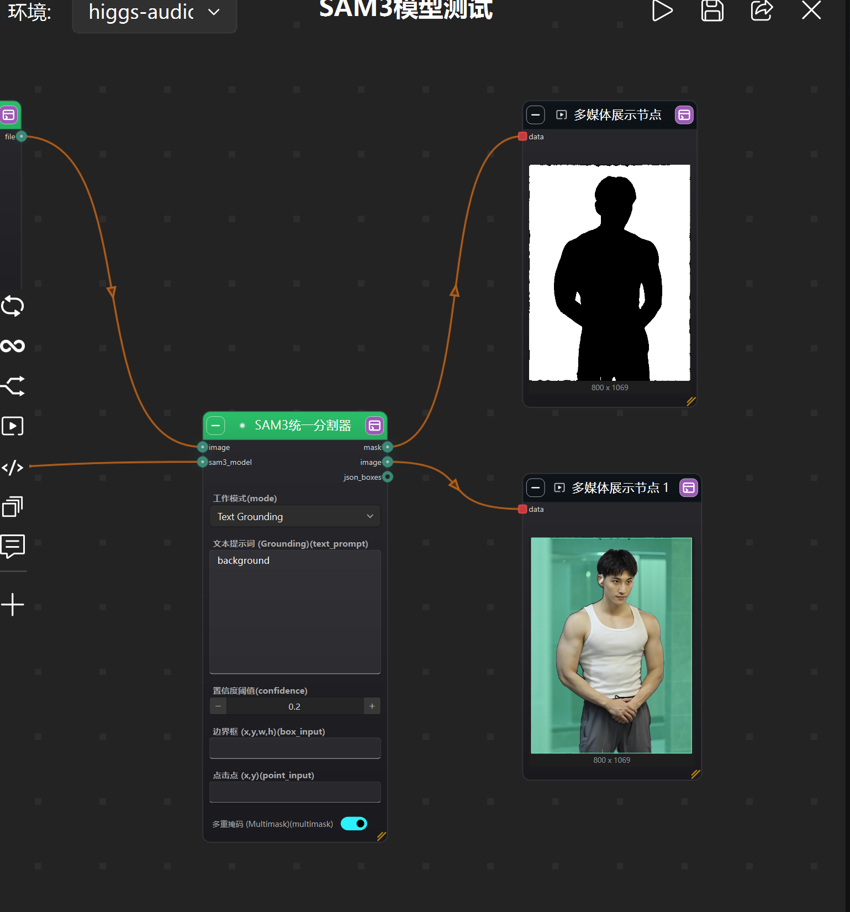

## SAM3 统一分割器

这是一个二合一节点，集成了 **文本提示分割 (Grounding)** 和 **交互式点击分割 (Segmentation)**。

### ⚙️ 属性参数

| 参数名 | 说明 |
| :--- | :--- |
| **mode** | **工作模式切换**。 • `Text Grounding`: 通过文本描述查找对象。 • `Interactive`: 通过点/框坐标分割对象。 |
| **text_prompt** | (仅文本模式) 输入描述，如 `"red car"`, `"face"`, `"cat"`。 |
| **confidence** | (仅文本模式) 置信度阈值 (0.0-1.0)。默认 `0.2`。值越低召回率越高，但可能包含误检。 |
| **box_input** | (仅交互模式) **边界框坐标**。格式为字符串 `"x,y,w,h"` (归一化 0-1)。 示例: `"0.5,0.5,0.2,0.2"` (图像中心 20% 大小的区域)。 |
| **point_input** | (仅交互模式) **点击点坐标**。格式为字符串 `"x,y"` (归一化 0-1)。 示例: `"0.5,0.5"` (点击图像正中心)。 |
| **multimask** | (仅交互模式) 是否生成多层级掩码。`True` 效果通常更好。 |

### 📝 输出
*   **mask**: 分割后的黑白遮罩。
*   **image**: 带有分割结果可视化覆盖的原图预览。
*   **json_boxes**: 检测到的边界框数据 (JSON 格式)。

### 💡 坐标说明
*   坐标必须是 **0.0 到 1.0** 之间的浮点数 (归一化坐标)。
*   `0,0` 是左上角，`1,1` 是右下角。
*   不需要手动计算像素值，模型会自动根据图片分辨率缩放。